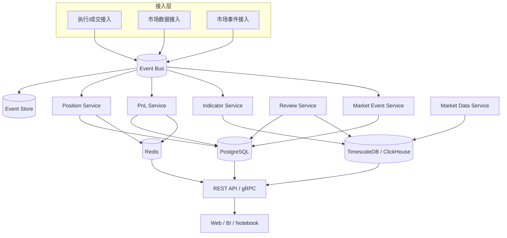

# 系统架构设计

## 架构模式

建议采用“事件驱动 + 读写分离 + 可回放”架构。

## 模块职责

### 1. marketdata-service
负责市场价格接入、标准化、落库、回补、质量标记。

### 2. position-service
负责 Fill 幂等入账、仓位聚合、成本法、快照。

### 3. pnl-service
负责 realized/unrealized/funding/fees/slippage/equity 计算。

### 4. indicator-service
负责 K 线指标计算与查询。

### 5. review-service
负责交易分组、绩效指标、报表和导出。

### 6. marketevent-service
负责新闻、公告、宏观、链上事件的结构化和检索。

## 为什么不直接单体数据库算全部

因为系统有两类数据：

1. 强事务数据：fill、cash、账本、权限
2. 高吞吐时序数据：tick、candle、indicator、equity curve

把两类数据完全塞进同一张事务库表，后期查询与写入会互相牵制。  
所以建议：
- PostgreSQL：事实与审计
- Timescale/ClickHouse：时序与分析
- Redis：热点读缓存
